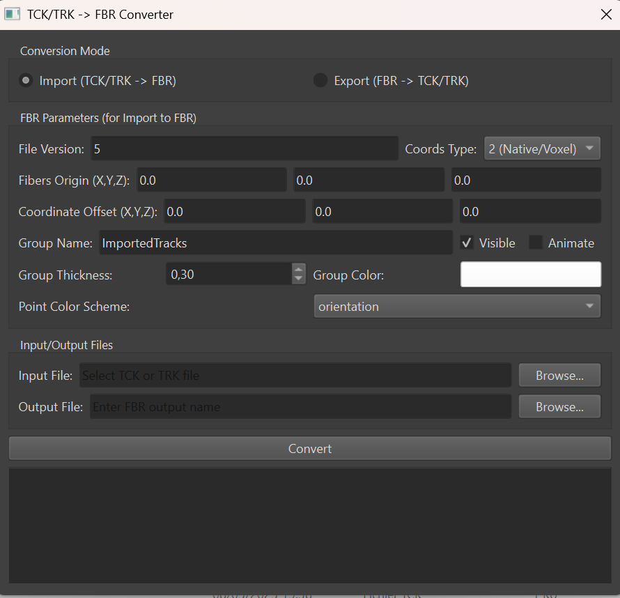
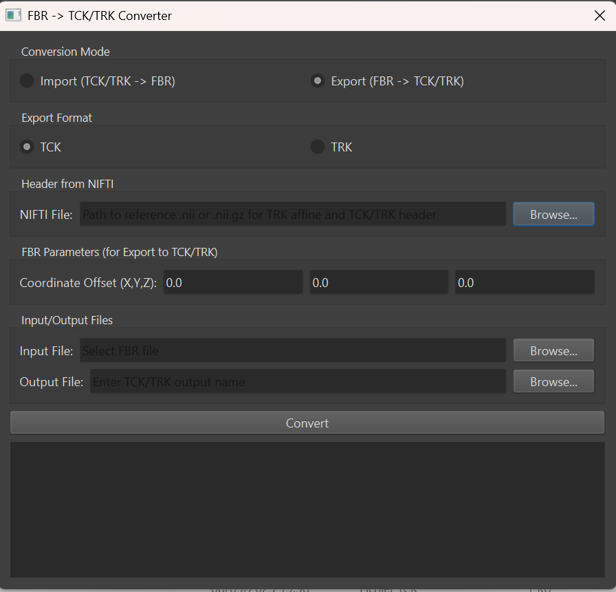

# BrainVoyager TCK/TRK <-> FBR Converter Plugin

**Version:** 1.0
**Author:** Quentin Dessain
**Date:** 2025-05-09

A Python plugin for BrainVoyager to facilitate the conversion between common tractography file formats (.tck, .trk) and BrainVoyager's native fiber format (.fbr). This tool provides a graphical user interface (GUI) for easy operation within the BrainVoyager environment.

## Features

*   **Import TCK/TRK to FBR:** Convert streamlines from .tck (MRtrix) or .trk (TrackVis) formats into BrainVoyager's .fbr format.
    *   Customizable FBR header parameters (File Version, Coords Type, Fibers Origin).
    *   Coordinate offset adjustments for fine-tuning spatial alignment.
    *   Control over FBR group properties (Name, Visibility, Animation, Thickness, Color).
    *   Flexible point coloring schemes:
        *   **Orientation-based:** Colors streamlines based on their local orientation (XYZ -> RGB).
        *   **Default color:** Assigns a uniform user-defined color to all points.
*   **Export FBR to TCK/TRK:** Convert BrainVoyager .fbr files to .tck or .trk formats.
    *   Choice of output format (.tck or .trk).
    *   Coordinate offset adjustments (inverse of import offset).
    *   **Header Information for TCK/TRK:** Ability to specify a reference NIFTI file (.nii/.nii.gz) to populate the output TCK/TRK header with crucial metadata:
        *   `voxel_to_rasmm` affine transformation (especially important for TRK).
        *   `voxel_order` (axis codes).
        *   `voxel_sizes`.
        *   `dimensions`.
*   **User-Friendly GUI:** Integrated into BrainVoyager via PySide6 for interactive conversions.
*   **Standalone Capability:** Core logic can be run outside BrainVoyager (requires `nibabel`, `numpy`, `PySide6`).

## Screenshots

### Import Mode (TCK/TRK to FBR)

### Export Mode (FBR to TCK/TRK)

## Requirements

*   **BrainVoyager:** Version 22.0 or later.
*   **Python Environment (within BrainVoyager or standalone):**
    *   `numpy`
    *   `nibabel`
    *   `PySide6`
	
## Installation

1.  Download the `TCKTRK_FBR_Converter.py` file.
2.  Place the file into your BrainVoyager Python plugins folder:
    *   **Windows:** `Documents\BrainVoyager\BVExtensions\PythonPlugins`
    *   **macOS:** `~/Documents/BrainVoyager/BVExtensions/PythonPlugins`
    *   **Linux:** `~/Documents/BrainVoyager/BVExtensions/PythonPlugins`
    *(The exact path might vary slightly based on your BrainVoyager installation and user settings.)*
3.  Restart BrainVoyager.
4.  The plugin should appear under `Python > Python Development > Plugins > TCKTRK FBR Converter`.

## Usage

### Import Mode (TCK/TRK -> FBR)

*   **FBR Parameters:**
    *   **File Version:** Typically `5` for modern FBR files.
    *   **Coords Type:**
        *   `0 (Talairach)`
        *   `1 (MNI)`
        *   `2 (Native/Voxel)`: Recommended if your TCK/TRK coordinates are in voxel space or a native scanner space that you intend to align within BV.
    *   **Fibers Origin (X,Y,Z):** Origin point for the FBR fiber space. Often `(0,0,0)`.
    *   **Coordinate Offset (X,Y,Z):** An offset applied to the incoming TCK/TRK coordinates *before* writing to FBR. Use this to adjust for differences in coordinate system origins (e.g., if TCK/TRK data is centered differently than BV's expected 0-255 range for native space).
        *   `FBR_point = TCK_point + Offset`
        *   Then, `FBR_point` is negated and YZX coordinates are swapped for FBR storage.
    *   **Group Name:** Name for the fiber group in the FBR file.
    *   **Visible/Animate:** Checkboxes for group display properties.
    *   **Group Thickness:** Visual thickness of fibers in BV.
    *   **Group Color:** Default color for the group (can be overridden by point colors).
    *   **Point Color Scheme:**
        *   `orientation`: Colors each point based on the orientation of the segment it starts. RGB maps to |X|,|Y|,|Z| displacement.
        *   `default`: Assigns the "Default Point Color" to all points.
    *   **Default Point Color:** (Visible if "default" scheme is selected) The color to use for all fiber points.

### Export Mode (FBR -> TCK/TRK)

*   **Export Format:**
    *   **TCK:** MRtrix format.
    *   **TRK:** TrackVis format.
*   **Header from NIFTI:**
    *   **NIFTI File:** Browse for a NIFTI file (.nii or .nii.gz) that is in the same space as your FBR data (e.g., the DWI or anatomical scan from which fibers were derived or to which they are aligned). This file's header will be used to populate:
        *   Voxel-to-RASmm affine matrix (critical for TRK spatial interpretation).
        *   Voxel order (e.g., "RAS", "LPI").
        *   Voxel sizes.
        *   Image dimensions.
        *   *Note: For TCK, the affine is typically identity, but voxel order, sizes, and dimensions from the NIFTI can still be informative.*
*   **FBR Parameters (for Export to TCK/TRK):**
    *   **Coordinate Offset (X,Y,Z):** An offset subtracted from the FBR coordinates *before* writing to TCK/TRK. This should typically be the *same* offset used during an import if you are reversing the process.
        *   `TCKTRK_point = (Internal_FBR_point_after_YZX_swap_and_negation) - Offset`

### Conversion

*   After setting all parameters, click the **"Convert"** button.
*   Progress and any messages will be displayed in the status log area.

## Author

*   **Quentin Dessain**

## Contributing

Contributions, bug reports, and feature requests are welcome. Please open an issue or submit a pull request.
